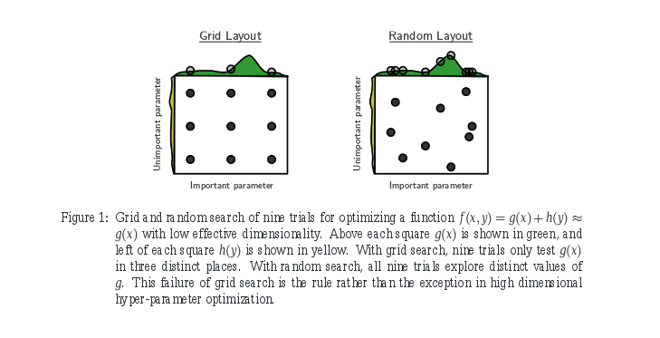

simbo
=====

An experiment in rethinking A/B testing, based on Sequential Model-Based Optimization (SMBO).

Despite being big believers in A/B testing, there are some flaws that we believe can be done without:

- Manual intervention: A/B testing is a manual process with scheduling tests and making decisions. Furthermore, these manual steps add human bias to the results.

- Poor scalability to higher dimensional parameter spaces: since the search space grows exponentially in the number of variables to test, practicioners are generally forced into testing a small subset of variables on their own.

- Greedy/local search is a poor optimization algorithm: because of the previous point, decisions are often made in a sequential manner, which excludes entire regions of the search space. Even if this may not be that big of an issue in some domains, it could result in a much slower convergence rate compared to other algorithms.

Requirements
---

This was tested on:

- Python 2.7.6

- Packages in requirements.txt

- requirements of [python-nvd3](https://github.com/areski/python-nvd3)

Running
---

`python server.py`

How It Works
---

TODO

FAQ
---

#### How do you calculate the best points to use? ####

We compute each points' expected positive improvement (see page 8 of [this paper](http://www.cs.ubc.ca/~hutter/papers/11-LION5-SMAC.pdf)). To quote the paper:

> it offers an automatic tradeoff between exploitation (focusing on known good parts of the space) and exploration (gathering more information in unknown parts of the space)

#### What about multiple objective values? ####

While it would be possible to model/optimize for multiple objective values, we believe that is is unnecessary. When it comes to making a decision, each of the multiple objectives will have to be combined together to rank the choices, hence that combination having to occur either way. We just require it to happen explicitly.

#### How can random search possibly be better than A/B testing? ####

A common complaint in our experience and those we have spoken to is that a majority of parameters tested are unimportant. By testing multiple parameters at the same time, one can explore the possible options for the important variables much more quickly.

Imagine there are 99999 useless parameters to test, and one good one. A grid search (A/B test) would have search through each parameter individually, while random search can search through values of the good parameter with every experiment.

For more information on the merits of random search, see [this paper](http://jmlr.org/papers/volume13/bergstra12a/bergstra12a.pdf).

#### Why not just use random search then? ####

Because we can do better! Random search can be very dumb when it comes to searching through parameter space, since it doesn't take into account any history. By taking historic results into account, we can guide the search areas with known good behavior (to search more thoroughly and try to improve on our best) or areas that are poorly explored (since we have little to no information on how good those parameters would behave).
